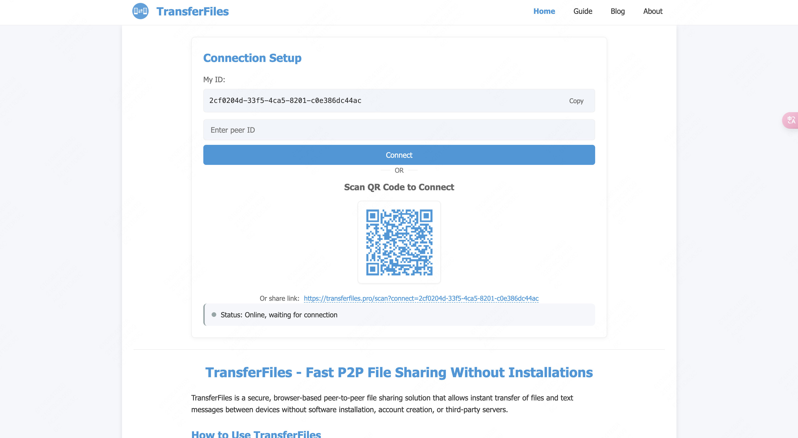

# TransferFiles

<div align="center">
  <h3>Fast, secure, and direct file transfers between any devices - no installation required.</h3>
  
  
  
  
</div>

## Overview

TransferFiles is an open-source web application that enables secure file transfers between any devices, without requiring installation, shared networks, or user accounts. Built with modern web technologies, it creates direct peer-to-peer connections for fast, private file sharing.

**Demo**: [https://transferfiles.pro](https://transferfiles.pro)



## Key Features

- **Universal Compatibility**: Works between any devices and operating systems (Windows, macOS, iOS, Android, Linux)
- **No Installation**: Runs entirely in the browser with no downloads or plugins required
- **Network Independent**: Transfer files between devices on different networks or locations
- **End-to-End Encryption**: All transfers are secured with WebRTC's built-in encryption
- **No Size Limits**: Transfer files of any size without restrictions
- **Privacy-Focused**: Files are transferred directly between devices, never through our servers
- **No Account Required**: Use instantly without registration or personal information
- **Instant Messaging**: Text chat alongside file transfers in an IM-style interface
- **QR Code Connectivity**: Quickly connect devices by scanning a QR code

## How It Works

TransferFiles uses WebRTC technology with STUN/TURN servers to establish direct peer-to-peer connections between devices:

1. **Connect Devices**: Generate a unique ID or QR code on one device and enter/scan it on another
2. **Select Files**: Choose files to send or type messages in the chat interface
3. **Transfer Content**: Files and messages are sent directly to the connected device
4. **Instant Access**: Access transferred files immediately, with download options

The technology behind TransferFiles enables connections across different networks and NAT types, making it work in scenarios where traditional file sharing methods fail.

## Getting Started

### Prerequisites

- Node.js 18.x or higher
- npm or yarn

### Installation

1. Clone the repository:
   ```bash
   git clone https://github.com/CoderLim/transferfiles.git
   cd transferfiles
   ```

2. Install dependencies:
   ```bash
   npm install
   # or
   yarn install
   ```

3. Set up environment variables:
   Create a `.env.local` file with the following (optional):
   ```
   NEXT_PUBLIC_GA_ID=your-google-analytics-id
   ```

4. Run the development server:
   ```bash
   npm run dev
   # or
   yarn dev
   ```

5. Open [http://localhost:3000](http://localhost:3000) in your browser.

### Building for Production

```bash
npm run build
# or
yarn build
```

## Technology Stack

- **Frontend Framework**: Next.js 14 (React)
- **Language**: TypeScript
- **Real-time Communication**: WebRTC via PeerJS
- **Connectivity**: STUN/TURN servers for NAT traversal
- **QR Code**: QRCode.js for connection sharing
- **Styling**: CSS with JSX styling
- **Blog System**: Markdown with gray-matter and remark
- **Analytics**: Google Analytics (optional)

## Use Cases

- Transfer photos from a phone to a computer
- Share work documents between office and home devices
- Send files to friends/family regardless of their location
- Move data between different operating systems
- Share code snippets or text between devices
- Quick file sharing without cloud storage

## Security Considerations

- All data transfers are end-to-end encrypted
- No data is stored on any servers
- Direct peer-to-peer connections when possible
- Relay servers only transmit encrypted data when direct connections aren't possible
- No user tracking or data collection beyond optional analytics

## Contributing

Contributions are welcome! Please feel free to submit a Pull Request.

1. Fork the repository
2. Create your feature branch (`git checkout -b feature/amazing-feature`)
3. Commit your changes (`git commit -m 'Add some amazing feature'`)
4. Push to the branch (`git push origin feature/amazing-feature`)
5. Open a Pull Request

## License

This project is licensed under the MIT License - see the LICENSE file for details.

## Support the Project

If you find TransferFiles useful, please consider supporting the project:

[](https://ko-fi.com/CoderLim)

## Acknowledgments

- [PeerJS](https://peerjs.com/) for WebRTC implementation
- [Next.js](https://nextjs.org/) for the React framework
- The WebRTC community for making peer-to-peer web communication possible

---

<p align="center">
  Made with ❤️ for a more open and private web
</p> 